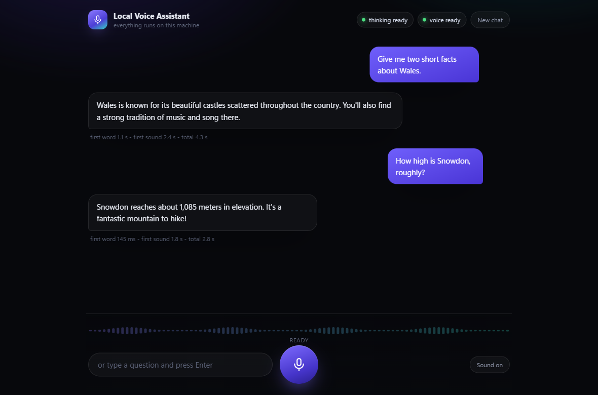

# Jetson Voice Assistant

**A voice assistant that runs entirely on a $249 Jetson Orin Nano Super. No cloud, no API keys, no account.**

You talk. It hears you - not a transcript of you, the actual audio - thinks, and talks back, all on a
board that draws less power than a light bulb. Two GGUF models on llama.cpp:

- **Gemma 4 E2B** listens and answers. It is natively multimodal, so your recording goes straight to
  the model. There is no separate speech-to-text step to mishear you first.
- **Pocket TTS** speaks the reply, sentence by sentence as the model writes it, so the first words
  come out of the speaker long before the last ones have been thought of.

Nothing leaves the board. Unplug the network after setup and it still works.

This is a port of [dwain-barnes/llama-tts-server](https://github.com/dwain-barnes/llama-tts-server)
(the Windows/x86 parent project) to ARM64 JetPack. The chain, the web UI and the custom warm TTS
server are the same; the install and launch layer is what changed.

> **Status: running on real hardware.** Everything below was measured on a Jetson Orin Nano Super
> 8 GB on JetPack 6 (L4T R36.4.7). The numbers in
> [What it actually does](#what-it-actually-does-measured-on-an-orin-nano-super-8-gb) are measured,
> not estimated. The one honest disappointment is speech on the CPU, which is far slower than the
> x86 parent project - see that section before you plan a conversation around it.

---

## Read this first: two things that will otherwise waste your afternoon

Both of these cost real hours to find. They are handled for you by `start.sh`, but you should know
why they are there.

**1. The page cache has to be dropped before every model load.** NvMap, the Tegra GPU memory
allocator, will not reclaim the Linux page cache to satisfy an allocation. If `MemFree` is low, every
`cudaMalloc` fails with `NvMapMemAllocInternalTagged error 12` - *even when `free -m` is showing
several gigabytes "available"*. The kernel counts reclaimable cache as available; NvMap does not.
The fix is one line, immediately before the load:

```bash
sudo sh -c 'sync; echo 3 > /proc/sys/vm/drop_caches'
```

`start.sh` does this before the language model, and again before the speech model if you have put
that on the GPU. It needs sudo without a password prompt, so the easy way to start is:

```bash
sudo -v && ./start.sh
```

If it cannot get sudo it prints a warning and carries on, and the load will probably fail. See
[The page cache trap](#the-page-cache-trap-nvmap-and-memfree).

**2. Start the servers one at a time, and gate on `curl -sf`.** `llama-server` answers `/health`
with **503 while it is still loading**, and a plain `curl -s` treats a 503 as success. Get that wrong
and the speech server starts early, grabs GPU memory in the middle of the language model's load, and
kills it. The `-f` is the whole point. `start.sh` waits for a real 200 from the language model before
anything else is allowed to touch the GPU.

## Hardware

| | |
|---|---|
| Board | Jetson Orin Nano Super Developer Kit, 8 GB |
| Software | JetPack 6.x (Ubuntu 22.04, L4T R36), CUDA 12.x |
| Storage | 32 GB free - ~4.4 GB of models, the rest is the llama.cpp build tree (not needed if you take the prebuilt binaries) |
| Swap | 8 GB swap file **for the build**. See below; without it the build is likely to be OOM-killed. Not needed if you take the prebuilt binaries. |
| Power mode | 25W ("Super") profile: `sudo nvpmodel -m 2 && sudo jetson_clocks` |
| Network | Only for setup. After that it is optional. |

A microphone and speaker are optional - the usual way to use this is from a browser on your laptop
or phone, which uses *that* device's microphone and speakers.

The 4 GB Orin Nano will not fit this. See the memory budget.

## Quickstart

```bash
git clone https://github.com/dwain-barnes/jetson-voice-assistant
cd jetson-voice-assistant
./setup.sh          # offers prebuilt binaries, then downloads the models
sudo -v && ./start.sh   # sudo so it can free the page cache before each model load
```

`setup.sh` is idempotent: run it again after an interrupted download or a failed build and it picks
up where it stopped.

### The fast path: prebuilt binaries

On an aarch64 board running JetPack 6 (`/etc/nv_tegra_release` mentioning `R36`), `setup.sh` offers
to download binaries that are already built, instead of compiling for 30 to 60 minutes:

```
https://github.com/dwain-barnes/jetson-voice-assistant/releases/tag/v1.0.0
jetson-voice-assistant-orin-jp6-cuda-arm64.tar.gz
```

The tarball holds `llama-server`, `llama-tts-server` and the `libggml*.so`, `libllama*.so` and
`libmtmd.so` they need. It was built on JetPack 6 / L4T R36.4.7 for CUDA arch 87, from llama.cpp
`9f0d017` with this repo's `llama-tts-server.patch` applied - the same recipe the source build uses.

Everything lands in `llama.cpp/build/bin/`. The shared objects sit *next to* the binaries rather than
being installed, so anything running them needs the loader pointed there:

```bash
LD_LIBRARY_PATH=llama.cpp/build/bin llama.cpp/build/bin/llama-server --version
```

`setup.sh` runs exactly that as a check before accepting the download, and `start.sh` exports the
same `LD_LIBRARY_PATH` for you.

If the download fails, the architecture is wrong, or the binaries will not run, `setup.sh` says so
and falls back to building from source. You can also decide for yourself:

```bash
./setup.sh --build-from-source   # never download; compile everything
./setup.sh --prebuilt            # never compile; fail if the download is unusable
```

Compiling yourself is the honest option if you would rather not run someone else's binaries. It
costs an hour, not a day.

## Talking to it

`start.sh` prints something like `http://192.168.1.42:8123`. Open it on your laptop or phone.



Type in the box and press enter, or hold the microphone button and speak. Replies stream in as text
and are spoken as each sentence finishes.

### What you said, written down

There is no speech-to-text in this chain and there is not going to be - Gemma listens to your audio
and answers it, which is the whole point, and a Whisper sitting next to it would want memory this
board does not have spare. So a spoken turn appears in the transcript as a chip: a waveform, and
*Spoken - 2.7s*. Once the reply is finished, the same model is asked one extra question - what did
that clip say? - and the chip turns into the words, with a small microphone and the duration left
underneath so it is still visibly something you said out loud. The words are also written back into
the conversation history, in place of the placeholder that used to stand in for a spoken turn, so
when the audio ages out of the context window the model remembers the question rather than the fact
that one was asked.

On this board that takes a few seconds, not the fifth of a second it takes on a desktop card. The
words turn up well after you have finished reading the answer, and in a hands-free conversation they
will often turn up while you are already listening to the next one. That is what it looks like when
it is working.

Nothing waits for it. The request goes out *after* the reply is done, never before and never
alongside, so the answer you hear is not delayed by a single millisecond. And the conversation always
wins: if you have started your next turn by the time it would be sent, it is not sent, and if you
start one while it is in flight, the connection is closed under it and the GPU goes straight back to
you. That matters more here than on a desktop - one GPU, and llama-server takes one request at a
time, so a transcript still generating is a transcript standing in your next question's way.
Rapid-fire talking therefore costs you the transcripts, not the speed: the chip simply stays as it
was, which is honest, because nobody wrote those words down. The same is true of a reply you cut off
mid-sentence, and of any transcription that fails - it is logged and forgotten. Set
`TRANSCRIBE_SPOKEN = False` at the top of `scripts/webui-server.py` to turn the whole thing off.

### Conversation mode

**[▶ Watch the demo](demo/jetson-demo.mp4)** — 30 seconds of real, unedited hands-free
conversation with the board.

One click and you just talk: an adaptive voice-activity detector calibrates to your room's noise for
a second, then watches energy levels, spots when you start and stop speaking, auto-sends each
utterance, and plays the reply.

Talk over it and it stops mid-sentence and yields. The reply is cut off where you cut it off, the
words it never got to say are never spoken, and what you were saying while you interrupted is the
next thing it answers.

The **Conversation** button next to the mic is the hands-free path: press it once and you never touch
the page again. The microphone stays open, a voice activity detector in the page decides where each
thing you say begins and ends, and every finished utterance is sent on its own. The dock says which
phase it is in - *listening to the room*, *conversation - listening*, *hearing you*, *thinking - talk
over it*, *speaking - talk over it* - and the level meter turns teal to say it is your turn. **Esc**,
or the button again, ends it.

#### Barge-in

A small **Barge-in** toggle appears beside **Conversation** while the mode is on. With it on the
microphone is never switched off - not while the assistant is thinking, not while it is talking - and
interrupting works the way it does with a person: you start talking, it stops.

Everything is stopped, not just the sound. The audio still queued for the sentences it had written
but not yet spoken is thrown away, the streaming request is aborted in the browser, and
`POST /api/interrupt` tells the server to stop pulling tokens out of the language model and to stop
feeding the speech server - a reply cut off after two sentences does not quietly synthesise the other
fifteen. This matters more here than on a desktop: the Jetson has one GPU and a speech model that is
not fast, so the work saved by not finishing a dead reply is work the *next* reply gets. The cut-off
reply is marked **interrupted** in the transcript, with an em dash where it stopped, and it is stored
in the conversation history as only what was actually said. Ask it later what it just told you and it
answers from the truncated version, because that is the only version it has.

Short replies are a different case, and worth knowing about. The model usually finishes writing long
before the last sentence has been spoken - especially here, where the speech model is the slow half -
so if you cut in near the end there is no stream left to abort and nothing to truncate: the sound
stops and it yields, but the reply on screen and in its memory is the whole thing, because the whole
thing is what it wrote. `/api/interrupt` reports `stopped: 0` in that case. Only a reply cut off
*while it was still being written* is marked interrupted and shortened in the history.

Interrupting has to cost more than starting to speak into silence, or the assistant's own voice
coming back through the microphone would cut it off constantly. So while it holds the floor the
detector wants roughly twice the volume (`interruptK`) and several times the persistence
(`interruptMs`, counted net - loud windows add, quiet ones take the same back) before it believes
you. A cough, a chair, a "mm-hm" fades back to nothing; someone actually talking crosses the line in
about half a second. On top of that the first `echoGuardMs` of every spoken chunk is a blind spot
while the echo canceller settles on the new sound.

**Barge-in needs the browser's echo canceller.** The page asks for `echoCancellation`,
`noiseSuppression` and `autoGainControl`, then reads back what it was actually given
(`track.getSettings()`, also logged to the console and shown in the toggle's tooltip). If echo
cancellation was refused, the toggle is disabled with a tooltip saying why and the mode falls back to
half duplex, because without it the assistant reliably interrupts itself. Headphones remove the
problem entirely. Loud speakers close to the microphone can still beat the echo canceller and make it
talk over itself - if that happens, switch barge-in off. The choice is remembered; conversation mode
itself still never starts by itself.

With barge-in off it is **half duplex**, which is what it was before: while the assistant is thinking
or talking it stops listening entirely, and only opens its ears again a quarter of a second after the
last sentence has played. That stops it hearing itself and answering its own reply. Speakers work
fine, you just wait your turn.

The microphone never opens on its own. The preference is remembered, so a returning session
highlights the button, but it still costs one click - and it needs a secure origin like any other
microphone access, so the LAN caveat below applies to it too.

The detector is deliberately simple - rolling RMS against an adaptive noise floor - and every number
it uses is at the top of `webui/app.js`:

| constant | default | what it does |
|---|---|---|
| `windowMs` | 20 | length of the RMS windows the detector reasons in |
| `calibrateMs` | 1000 | how long it listens to the room before arming |
| `thresholdK` | 3.2 | speech is anything above `noiseFloor * k` |
| `floorMin` | 0.004 | absolute floor, so a silent room cannot trigger on hiss |
| `floorMax` | 0.06 | ceiling on the measured floor, so a loud room is clamped rather than going deaf |
| `adapt` | 0.02 | how fast the floor follows the room while nothing is happening |
| `startMs` | 120 | speech-level audio needed before it says you have started |
| `endMs` | 700 | quiet needed before it says you have finished |
| `minSpeechMs` | 350 | anything with less voiced audio than this is a cough, and is dropped |
| `prerollMs` | 300 | audio kept from *before* the start, so the first syllable survives |
| `maxUtterMs` | 30000 | hard stop, so a stuck microphone cannot record forever |
| `resumeDelayMs` | 250 | settle time after the reply before listening again |
| `interruptK` | 6.4 | the bar for cutting the reply off, as `noiseFloor * k`. Kept at twice `thresholdK`, so tuning the room tunes both |
| `interruptMs` | 250 | **net** loud audio needed to interrupt: a loud 20 ms window adds, a quiet one takes the same back. Real speech dips below any bar between syllables, so an unbroken run of this length never happens - but a bang decays to nothing while talking climbs. In practice about half a second of speech |
| `echoGuardMs` | 300 | blind to interruptions for this long after each spoken chunk starts, while the echo canceller converges. Evidence is frozen, not erased, so someone who began talking just before the chunk did is not made to start again |

Raise `thresholdK` if a noisy room keeps triggering it; raise `endMs` if it cuts you off while you
think mid-sentence; lower it if the pause before an answer feels long. Raise `interruptK` if the
assistant talks over itself through loud speakers, or `interruptMs` if a passing noise keeps stopping
it mid-reply; lower either if you have to shout to get a word in.

### The microphone needs one extra step over the LAN

Browsers only hand out microphone access on *secure origins* - https, or localhost. The Jetson serves
plain http on your LAN, so the mic button will be refused there. **Typing always works**, on any
device, with no workaround.

Four ways to get the microphone, best first:

1. **SSH tunnel from your computer** - the recommended one, verified working, no browser settings:

   ```
   ssh -L 8123:localhost:8123 jetson@<jetson-ip>
   ```

   Leave that terminal open and browse to `http://localhost:8123` on your computer. Localhost counts
   as secure, so the microphone (and Conversation mode) just work, and the traffic is encrypted as a
   bonus.
2. **Browse from the Jetson itself.** `http://localhost:8123` counts as secure. If you have a monitor
   on the board, this is the easy answer.
3. **Tell Chrome to trust it.** Open `chrome://flags/#unsafely-treat-insecure-origin-as-secure`, add
   `http://192.168.1.42:8123` (your actual URL), and restart the browser. In practice this flag is
   fiddly - it must be the exact origin, the same Chrome profile, and a full relaunch - which is why
   the tunnel is listed first. Undo it when you are done; it is called "unsafely" for a reason.
4. **Put https in front of it.** A Tailscale/Caddy/nginx reverse proxy with a real certificate.
   Beyond the scope of this README, but it is the clean answer.

There is also a terminal path that needs no browser at all:

```bash
python3 scripts/voice-chat.py --text "Tell me three facts about Wales."
python3 scripts/voice-chat.py question.wav -o reply.wav
```

On Linux it plays through `paplay`, `aplay` or `ffplay`, whichever is installed. On a headless board
with no sound card it just writes the WAV and says nothing.

## What it actually does: measured on an Orin Nano Super 8 GB

JetPack 6 (L4T R36.4.7), 25W Super profile, nothing else on the GPU.

### Gemma 4 E2B, UD-Q4_K_XL, `-ngl 99`, `contextSize` 2048

| | |
|---|---|
| Model load | 30 to 60 seconds |
| Time to first token | 0.37 - 0.56 s |
| A short text answer, start to finish | under 1 second |

That part is genuinely good. Asking it a question and reading the answer feels immediate.

During the load `MemFree` dives to around **80 MB**. That is alarming and it is also normal - as long
as the page cache was dropped immediately beforehand, the load completes from there.

### Pocket TTS on the ARM CPU (the fallback for bigger quants)

| | |
|---|---|
| Speed | ~0.16x realtime |
| A short sentence | ~19 seconds of compute for a couple of seconds of audio |
| 4 threads vs 6 threads | no measurable difference; it is not thread-bound |

This is the honest bad news. **Usable for testing, not for conversation.** The x86 parent project
gets about 5.8x realtime on a desktop CPU; the A78AE cores are a long way from that, and raising
`ttsThreads` does not help. Sentence-at-a-time streaming cannot hide something running at a sixth of
realtime.

The text answer still arrives in under a second, so if you read replies rather than listen to them,
none of this matters.

### Pocket TTS on the GPU (the shipped default, paired with Q2)

| | |
|---|---|
| Speed | ~30x faster than the CPU path |
| Measured | 0.64 s to produce ~3 s of audio; ~1.5 s to first sound in the web UI |
| Fits alongside Gemma **Q2** on 8 GB? | **Yes** - this is the shipped default |
| Fits alongside Gemma **Q4** + a desktop session? | **No** |

This is why the default quant is `UD-Q2_K_XL`: it leaves room for the second CUDA context (~0.6 GB
before compute buffers) that GPU speech needs, and the result is a genuinely conversational
assistant. Raise the quant to `UD-Q4_K_XL` for smarter answers and the speech server no longer fits
on the GPU - it runs out during CUDA graph capture and dies - so set `ttsOnGpu` to `false` and
accept the ~19 s/sentence CPU voice. See [Speech on the GPU](#speech-on-the-gpu-ttsongpu).

## The page cache trap: NvMap and MemFree

The symptom is a CUDA allocation failing like this:

```
NvMapMemAllocInternalTagged: error 12
ggml_cuda_host_malloc: failed to allocate ...
```

while `free -m` cheerfully reports gigabytes available. Both readings are correct. `MemAvailable`
includes page cache the kernel would happily reclaim; NvMap allocates out of `MemFree` and will not
trigger that reclaim itself. A Jetson that has been reading model files - which is to say, a Jetson
you have used for anything - has most of its memory in page cache, so `MemFree` is small and every
`cudaMalloc` fails.

The fix is to convert that cache into genuinely free memory, immediately before each CUDA model load:

```bash
sudo sh -c 'sync; echo 3 > /proc/sys/vm/drop_caches'
```

"Immediately before" is not superstition. Anything that reads files in between - including the
previous model load - refills the cache.

`start.sh` does this automatically:

- before starting `llama-server`, always;
- before starting `llama-tts-server`, if `ttsOnGpu` is true.

It needs passwordless sudo to do it. `sudo -v && ./start.sh` caches your sudo timestamp for the next
few minutes, which is enough. `sudo ./start.sh` works too. If neither is available, `start.sh` prints
a warning explaining what to run by hand and carries on - it does not silently pretend everything is
fine.

Pass `--no-drop-caches` if you have your own arrangement and would rather not be told about it.

## Sharing the board with other GPU workloads

Most Jetsons are not blank. This one arrived running NVIDIA's **NanoOWL** demo out of the box, from a
systemd unit, in Docker, holding about **2.4 GB** and a slice of the GPU. Yours probably has
something similar. Find it before you blame this project:

```bash
systemctl list-units --type=service --state=running
docker ps
sudo tegrastats          # watch RAM while you stop things
```

### Stop it properly, for the session

```bash
sudo systemctl stop <service>
```

**Do not `pkill` it.** Two ways that goes wrong, both learned the hard way:

- Units with `Restart=on-failure` come back within seconds. The respawn lands *in the middle of* the
  language model's load and kills it, and because the timing is variable it looks like a random
  intermittent failure rather than the obvious thing it is.
- If the workload is containerized, killing the process you can see does not release the GPU memory.
  The container is still there holding it. The container is what has to stop.

Stopping the service leaves it **enabled**, so it comes back on the next reboot and you have not
quietly broken the demo the board shipped with. If you want it gone for good that is
`sudo systemctl disable --now <service>`, but that is your decision to make deliberately.

### If you want to keep the other workload running

With roughly 2.4 GB resident elsewhere, **`gemma-4-E2B-it-UD-Q4_K_XL` does not fit.** Your options:

```bash
./setup.sh --quant UD-Q2_K_XL    # 2.24 GiB - fits, but it is tight and the answers are worse
```

or stop the other workload while you are using the assistant. There is no third answer on 8 GB.

`start.sh` will not kill anything on your behalf. It is not its business to decide what else on your
board matters. If the language model fails to load it prints a hint that something else may be
holding GPU memory, and the commands above to find out what.

## Memory budget

This is the whole design problem. The Orin Nano's 8 GB is **unified** - the GPU does not have its own
memory, it shares the system's. Every megabyte the language model takes is a megabyte Ubuntu does not
have, and when it runs out there is no swapping a CUDA allocation back in; something gets killed.

Of the 8 GB, roughly **7.4 GiB** is actually addressable after the carve-outs.

| What | Where | Size |
|---|---|---|
| `gemma-4-E2B-it-UD-Q4_K_XL.gguf` | GPU | 2.97 GiB |
| `mmproj-F16.gguf` (audio + vision projector) | GPU | 0.92 GiB |
| KV cache + compute buffers @ 2048 ctx | GPU | ~0.25 GiB |
| `pocket-tts-en.gguf` | CPU | 0.15 GiB |
| `mmproj-pocket-tts-en.gguf` | CPU | 0.06 GiB |
| Python web UI + proxy | CPU | ~0.10 GiB |
| Ubuntu, headless | CPU | ~1.20 GiB |
| **Total** | | **~5.65 GiB** |
| **Headroom** | | **~1.7 GiB** |

The headroom is not slack. It is the budget for a desktop session, a browser on the board, page cache
during model load, and the spike when Pocket TTS allocates its audio graph on the first request. On
the real board that headroom is entirely consumed during the load - `MemFree` bottoms out around
80 MB - which is why the page cache has to be dropped first.

**`contextSize` is 2048 by default**, lowered from 4096 after measuring this. 2048 is comfortable for
question-and-answer use. Raise it in `config.local.json` if you have room - if you are headless, on
a smaller quant, or you have stopped everything else - and watch `tegrastats` while you do.

If you are tight - running a desktop, or something else on the board - drop to a smaller quant:

```bash
./setup.sh --quant UD-Q3_K_XL      # 2.72 GiB, saves ~0.25 GiB, slightly worse
./setup.sh --quant UD-Q2_K_XL      # 2.24 GiB, noticeably worse; the one that fits next to other workloads
```

Going *up* is possible if you run truly headless and accept the risk: `--quant Q5_K_M` (3.13 GiB) or
`Q6_K` (4.19 GiB, which will not leave room for much else).

## Speech on the GPU: `ttsOnGpu`

`config.json` ships `"ttsOnGpu": false`. Setting it to `true` in `config.local.json` makes `start.sh`
launch `llama-tts-server` with `-ngl 99` and *without* hiding the GPU from it:

```json
{ "ttsOnGpu": true }
```

That buys roughly **30x**: 0.64 s for about three seconds of audio, against ~19 s on the CPU. It is
the difference between a demo and a conversation.

It also very often does not fit. The second CUDA context is ~0.6 GB before compute buffers, and the
failure arrives during CUDA graph capture, on the first request rather than at load. Try it only if:

- you are on `UD-Q2_K_XL` (2.24 GiB) rather than Q4, **or**
- the board is genuinely headless - no desktop session, no browser on the Jetson, nothing else on the
  GPU.

If the speech server dies at startup or on the first synthesis, put it back to `false`. `start.sh`
warns you about all of this at the point it launches, and again if the launch fails.

### Why CPU mode needs an empty `CUDA_VISIBLE_DEVICES`

`-ngl 0` is **not** enough to keep `llama-tts-server` off the GPU on a CUDA build. The mtmd audio
projector allocates CUDA buffers regardless of the layer count. When Gemma already owns the GPU, that
allocation fails and takes the speech server down with a ggml assert - a confusing crash, because you
asked for zero GPU layers and got a CUDA error anyway.

`start.sh` launches it with `CUDA_VISIBLE_DEVICES=""` (empty), which hides the device from that child
process entirely. The Windows parent project does the same thing with `CUDA_VISIBLE_DEVICES=-1`. If
you launch the speech server by hand, do this too.

## The models

Everything `setup.sh` downloads, with the sizes confirmed against the Hugging Face API:

| File | Repo | Bytes |
|---|---|---|
| `gemma-4-E2B-it-UD-Q2_K_XL.gguf` (default) | [unsloth/gemma-4-E2B-it-GGUF](https://huggingface.co/unsloth/gemma-4-E2B-it-GGUF) | 2.24 GiB |
| `gemma-4-E2B-it-UD-Q4_K_XL.gguf` (`--quant UD-Q4_K_XL`) | unsloth/gemma-4-E2B-it-GGUF | 3,184,496,736 (2.97 GiB) |
| `mmproj-F16.gguf` | unsloth/gemma-4-E2B-it-GGUF | 985,654,080 |
| `pocket-tts-en.gguf` | [EryriLabs/pocket-tts-GGUF](https://huggingface.co/EryriLabs/pocket-tts-GGUF) | 159,390,816 |
| `mmproj-pocket-tts-en.gguf` | EryriLabs/pocket-tts-GGUF | 59,858,080 |
| `unmute-prod-website/default_voice.wav` | [kyutai/tts-voices](https://huggingface.co/kyutai/tts-voices) | 480,044 |
| | **default set** | **4,389,879,756 (~4.09 GiB)** |

`UD-Q2_K_XL` is the default because it is the quant that leaves room for speech on the GPU (the
config that makes conversation feel natural), and because it still fits when something else on the
board is holding ~2.4 GB. `UD-Q4_K_XL` is noticeably better at following instructions - the price is
CPU speech (~19 s/sentence).

Two notes on those choices:

- **F16, not BF16, for the projector.** The repo ships both at almost the same size (985 MB vs
  986 MB). Ampere handles F16 in hardware, and llama.cpp's CUDA backend is best-trodden on F16, so
  there is nothing to gain from BF16 here.
- **Pocket TTS runs on the GPU by default** (`ttsOnGpu: true`), which is what makes replies start in
  about a second and a half. It fits because the default quant is Q2. If you move up to Q4, set
  `ttsOnGpu: false` - speech falls back to 4 of the 6 Cortex-A78AE cores at ~0.16x realtime. See the
  performance section.

## Building

If you took the prebuilt binaries you can skip this entire section.

`setup.sh` clones llama.cpp at exactly **`9f0d017`**, applies `llama-tts-server.patch`, and builds:

```
cmake -DGGML_CUDA=ON -DCMAKE_CUDA_ARCHITECTURES=87 -DLLAMA_CURL=OFF \
      --target llama-server llama-tts-server
```

The commit is pinned because the patch is a real diff against that tree; a later master will very
likely reject it.

**The build takes 30 to 60 minutes** and is the slowest part of the whole exercise. The CUDA kernels
are what take the time.

### Swap, and why the build dies without it

`nvcc` can want well over a gigabyte per translation unit. Six of those at once, on a board with
8 GB shared with everything else, is how a build gets OOM-killed at 90%. JetPack's zram helps a
little - it compresses RAM rather than adding any - but for a CUDA build you want real swap:

```bash
sudo fallocate -l 8G /swapfile
sudo chmod 600 /swapfile
sudo mkswap /swapfile
sudo swapon /swapfile
echo '/swapfile none swap sw 0 0' | sudo tee -a /etc/fstab
```

`setup.sh` checks for this and, if swap is thin, quietly backs the build off to `-j4`. You can
`swapoff` afterwards - inference does not want swap, and a swapping Jetson is a slow Jetson.

## Starting on boot

```bash
sed -e "s/CHANGEME/$USER/g" -e "s#/home/CHANGEME/jetson-voice-assistant#$PWD#g" \
    voice-assistant.service | sudo tee /etc/systemd/system/voice-assistant.service
sudo systemctl daemon-reload
sudo systemctl enable --now voice-assistant
journalctl -u voice-assistant -f
```

Run `./setup.sh` and one successful `./start.sh` by hand first.

The unit runs as your user, not root, so it cannot free the page cache by itself. Two things bridge
that gap:

- `ExecStartPre=+/bin/sh -c 'sync; echo 3 > /proc/sys/vm/drop_caches'` in the unit. The leading `+`
  tells systemd to run that one step as root. This covers the first model load.
- A sudoers drop-in, if you want `start.sh` to be able to drop the cache again between the two
  models. The commands are in the comments at the top of `voice-assistant.service`. Optional.

If you have stopped another GPU service to make room, remember it is still *enabled* and will be back
after the reboot, competing with this one for the same memory. Boot order between two enabled
services is not something you want to be relying on for 8 GB of shared memory - disable one of them.

## Configuration

`setup.sh` writes `config.local.json`. Edit it to change ports, context size, TTS placement or model
paths; `config.json` is the shipped template and is never written to, so pulling an update will not
undo your settings.

```json
{
  "llmPort": 8090,
  "ttsPort": 8100,
  "webUiPort": 8123,
  "contextSize": 2048,
  "llmGpuLayers": 99,
  "ttsThreads": 4,
  "ttsOnGpu": true,
  "ttsGpuLayers": 99
}
```

| Key | Default | Notes |
|---|---|---|
| `contextSize` | 2048 | The safe value on 8 GB. Was 4096 before hardware testing. Raise it only with headroom to spare. |
| `llmGpuLayers` | 99 | All of them. Gemma E2B fits on the GPU; there is no reason to split it. |
| `ttsThreads` | 4 | Only used when `ttsOnGpu` is `false`. 6 measured identical to 4 - the CPU speech path is not thread-bound. |
| `ttsOnGpu` | `true` | ~30x faster than CPU speech. Fits because the default quant is Q2; set `false` if you raise the quant to Q4. |
| `ttsGpuLayers` | 99 | Only used when `ttsOnGpu` is `true`. |

Command line:

```bash
./start.sh --localhost         # bind the UI to 127.0.0.1 instead of every interface
./start.sh --no-warmup         # skip the warm-up requests
./start.sh --no-webui          # just the two model servers
./start.sh --no-drop-caches    # do not touch the page cache (and stop warning about it)
```

## How it fits together

```
browser --WAV--> webui-server.py (8123) --> llama-server (8090)    Gemma 4 E2B, GPU
                        |                        | streamed tokens
                        |<-----------------------+
                        | one finished sentence at a time
                        +------------------> llama-tts-server (8100)  Pocket TTS, CPU
browser <--SSE: text deltas + audio urls--+
```

Startup order is fixed and each step is gated on the one before it:

```
drop page cache -> llama-server -> wait for HTTP 200 on /health (curl -sf)
  -> [drop page cache again, if ttsOnGpu] -> llama-tts-server -> wait for /health
  -> warm-up request to each -> web UI
```

Nothing overlaps. Two CUDA allocations racing each other on this board means one of them loses.

`llama-tts-server` is the piece that is not in upstream llama.cpp. Upstream's `llama-tts` is a
one-shot CLI that loads the model, speaks, and exits - useless in a conversation, where you would pay
the model load on every sentence. The patch adds a server that keeps the model warm behind an
OpenAI-compatible `/v1/audio/speech` endpoint. That is what makes sentence-by-sentence streaming
possible at all.

`--reasoning off` on llama-server is not optional. Gemma 4 is a thinking model; left to reason, it
spends the entire token budget on it and returns empty content, which the speech server then refuses.

## Troubleshooting

| Symptom | Likely cause |
|---|---|
| `NvMapMemAllocInternalTagged error 12`, or `cudaMalloc failed`, while `free -m` shows gigabytes available | The page cache. `sudo sh -c 'sync; echo 3 > /proc/sys/vm/drop_caches'` immediately before loading, or start with `sudo -v && ./start.sh`. |
| `start.sh` warns it cannot free the page cache | sudo wanted a password. `sudo -v && ./start.sh`, or `sudo ./start.sh`. |
| `MemFree` drops to ~80 MB during the load | Normal on this board. It completes if the cache was dropped first. |
| The language model dies partway through loading, unpredictably | Something else grabbed the GPU. Often a systemd service respawning after you `pkill`ed it. Use `sudo systemctl stop <service>`. |
| The language model will not load at all | Another GPU workload is resident. `systemctl list-units --state=running`, `docker ps`. With ~2.4 GB held elsewhere, use `--quant UD-Q2_K_XL`. |
| The speech server dies with a ggml assert about a CUDA buffer | The mtmd audio projector allocated on the GPU despite `-ngl 0`. It must run with `CUDA_VISIBLE_DEVICES=""`; `start.sh` does this, so check nothing in your environment overrides it. |
| Speech is fine but slow - ~19 s per sentence | Expected on the CPU (~0.16x realtime). Raising `ttsThreads` will not help. See `ttsOnGpu`. |
| GPU speech dies during CUDA graph capture | It does not fit next to Gemma Q4. Set `ttsOnGpu` back to `false`, or move to `UD-Q2_K_XL`, or run headless. |
| The speech server starts before the language model has finished loading | A health check without `-f`. `llama-server` returns 503 while loading and `curl -s` calls that success. |
| Build killed around 90% | Not enough swap. Add the swap file above and re-run `./setup.sh`. Or take the prebuilt binaries. |
| Prebuilt `llama-server` will not start | Missing `LD_LIBRARY_PATH`. The `.so` files sit beside it: `LD_LIBRARY_PATH=llama.cpp/build/bin`. If it still fails, `./setup.sh --force --build-from-source`. |
| `nvcc: not found` | JetPack puts it in `/usr/local/cuda/bin`. `export PATH=/usr/local/cuda/bin:$PATH`. |
| The mic button does nothing | Expected over http on the LAN - see the microphone section. Typing still works. |
| Everything is slow | `sudo nvpmodel -m 2 && sudo jetson_clocks` for the 25W profile. |
| A server dies shortly after "READY" | Out of memory. Check `dmesg -T \| grep -i oom` and drop to a smaller quant. |
| `port 8090 is already in use` | An earlier copy of *this* project is still running: `pkill -f llama-server`. (Only ever pkill your own processes - not a systemd service.) |

Logs from the last run are in `logs/`.

## Credits

- [llama.cpp](https://github.com/ggml-org/llama.cpp) - the runtime everything here stands on.
- [Kyutai](https://huggingface.co/kyutai) - Pocket TTS and the reference voices (CC-BY-4.0).
- [EryriLabs](https://huggingface.co/EryriLabs/pocket-tts-GGUF) - the Pocket TTS GGUF conversions.
- [Google DeepMind](https://huggingface.co/google) for Gemma 4, and
  [unsloth](https://huggingface.co/unsloth) for the dynamic quants.
- [dwain-barnes/llama-tts-server](https://github.com/dwain-barnes/llama-tts-server) - the parent
  project this is ported from, where the TTS server patch and the web UI come from.

MIT licensed. The models carry their own licences (Gemma Terms of Use; Pocket TTS CC-BY-4.0).
